# AutoDevHub System Architecture

## Overview
AutoDevHub is an AI-powered DevOps tracker designed to automate software development workflows, generate documentation, and deploy software artifacts. This document provides a comprehensive architectural overview of the system components, data flows, and deployment strategies.

## 1. High-Level System Architecture

```mermaid
graph TB
    subgraph "Client Layer"
        WEB[Web Interface<br/>React Frontend]
        CLI[CLI Interface<br/>Command Line Tools]
        API_CLIENT[API Clients<br/>External Integrations]
    end
    
    subgraph "API Gateway Layer"
        GATEWAY[API Gateway<br/>FastAPI Router]
        AUTH[Authentication<br/>JWT & OAuth]
        RATE_LIMIT[Rate Limiting<br/>Request Throttling]
    end
    
    subgraph "Application Services"
        STORY_SVC[Story Generator<br/>AI Story Creation]
        DOC_SVC[Documentation Service<br/>Auto Documentation]
        WORKFLOW_SVC[Workflow Engine<br/>DevOps Automation]
        NOTIFICATION_SVC[Notification Service<br/>Event Broadcasting]
    end
    
    subgraph "AI & External Services"
        CLAUDE[Claude AI<br/>Story Generation]
        GITHUB_API[GitHub API<br/>Repository Management]
        CI_CD[GitHub Actions<br/>Deployment Pipeline]
    end
    
    subgraph "Data Layer"
        SQLITE[(SQLite Database<br/>Primary Data Store)]
        REDIS[(Redis Cache<br/>Session & Performance)]
        FILES[File Storage<br/>Documentation & Assets)]
    end
    
    subgraph "Infrastructure"
        MONITOR[Monitoring<br/>Health & Metrics]
        LOGS[Logging<br/>Application Logs]
        BACKUP[Backup<br/>Data Protection]
    end
    
    %% Client connections
    WEB --> GATEWAY
    CLI --> GATEWAY
    API_CLIENT --> GATEWAY
    
    %% API Gateway routing
    GATEWAY --> AUTH
    GATEWAY --> RATE_LIMIT
    GATEWAY --> STORY_SVC
    GATEWAY --> DOC_SVC
    GATEWAY --> WORKFLOW_SVC
    
    %% Service dependencies
    STORY_SVC --> CLAUDE
    STORY_SVC --> POSTGRES
    DOC_SVC --> GITHUB_API
    DOC_SVC --> FILES
    WORKFLOW_SVC --> CI_CD
    WORKFLOW_SVC --> NOTIFICATION_SVC
    
    %% Data layer connections
    STORY_SVC --> REDIS
    AUTH --> REDIS
    DOC_SVC --> POSTGRES
    WORKFLOW_SVC --> POSTGRES
    
    %% Infrastructure connections
    STORY_SVC --> MONITOR
    DOC_SVC --> MONITOR
    WORKFLOW_SVC --> MONITOR
    POSTGRES --> BACKUP
    REDIS --> LOGS
    
    classDef client fill:#e1f5fe
    classDef gateway fill:#f3e5f5
    classDef service fill:#e8f5e8
    classDef external fill:#fff3e0
    classDef data fill:#fce4ec
    classDef infra fill:#f1f8e9
    
    class WEB,CLI,API_CLIENT client
    class GATEWAY,AUTH,RATE_LIMIT gateway
    class STORY_SVC,DOC_SVC,WORKFLOW_SVC,NOTIFICATION_SVC service
    class CLAUDE,GITHUB_API,CI_CD external
    class POSTGRES,REDIS,FILES data
    class MONITOR,LOGS,BACKUP infra
```

## 2. Component Architecture

### 2.1 Frontend Components

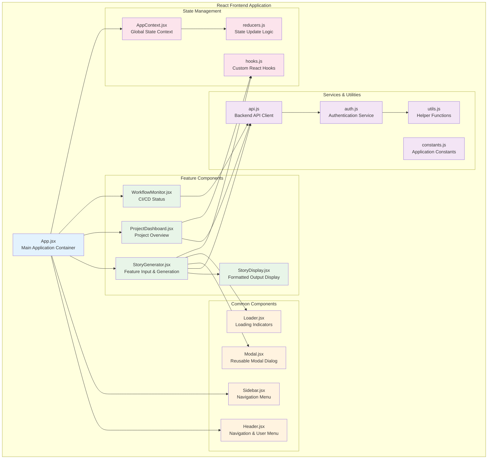

### 2.2 Backend Services Architecture

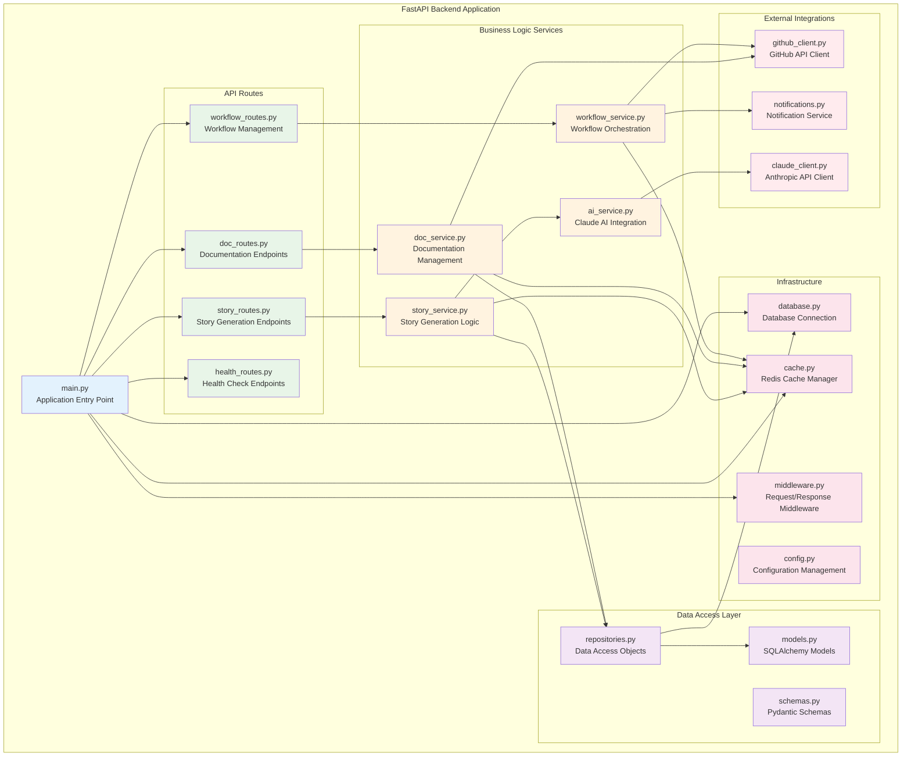

## 3. Data Flow Architecture

### 3.1 User Story Generation Flow

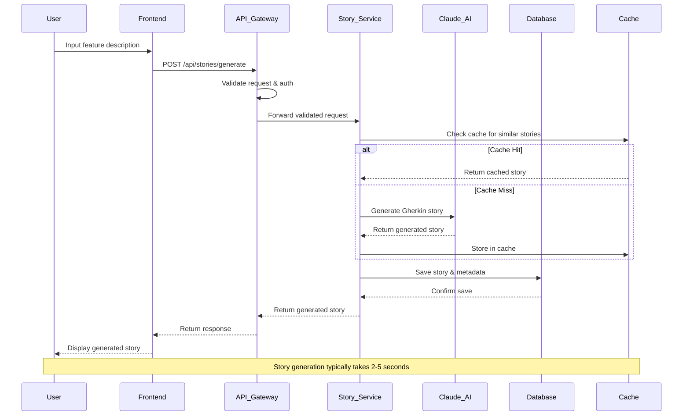

### 3.2 Documentation Workflow

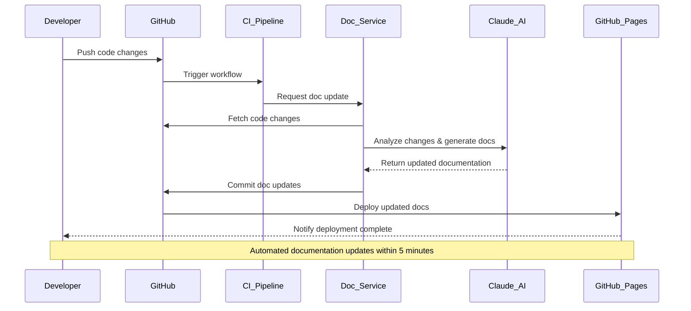

### 3.3 CI/CD Integration Flow

```mermaid
flowchart TD
    COMMIT[Code Commit] --> TRIGGER[Workflow Trigger]
    TRIGGER --> LINT[Code Linting]
    TRIGGER --> TEST[Unit Testing]
    TRIGGER --> SECURITY[Security Scan]
    
    LINT --> GATE1{Quality Gate}
    TEST --> GATE1
    SECURITY --> GATE1
    
    GATE1 -->|Pass| AI_REVIEW[AI Code Review]
    GATE1 -->|Fail| NOTIFY_FAIL[Notify Failure]
    
    AI_REVIEW --> BUILD[Build Application]
    BUILD --> INTEGRATION_TEST[Integration Testing]
    
    INTEGRATION_TEST --> GATE2{Deployment Gate}
    GATE2 -->|Pass| DEPLOY_STAGING[Deploy to Staging]
    GATE2 -->|Fail| ROLLBACK[Rollback Changes]
    
    DEPLOY_STAGING --> SMOKE_TEST[Smoke Testing]
    SMOKE_TEST --> GATE3{Production Gate}
    
    GATE3 -->|Pass| DEPLOY_PROD[Deploy to Production]
    GATE3 -->|Fail| NOTIFY_MANUAL[Manual Review Required]
    
    DEPLOY_PROD --> MONITOR[Production Monitoring]
    MONITOR --> HEALTH_CHECK[Health Verification]
    
    NOTIFY_FAIL --> END[End]
    ROLLBACK --> END
    NOTIFY_MANUAL --> END  
    HEALTH_CHECK --> END
    
    classDef process fill:#e8f5e8
    classDef gate fill:#fff3e0
    classDef deploy fill:#e3f2fd
    classDef end fill:#ffebee
    
    class LINT,TEST,SECURITY,AI_REVIEW,BUILD,INTEGRATION_TEST,SMOKE_TEST process
    class GATE1,GATE2,GATE3 gate
    class DEPLOY_STAGING,DEPLOY_PROD,MONITOR,HEALTH_CHECK deploy
    class NOTIFY_FAIL,ROLLBACK,NOTIFY_MANUAL,END end
```

## 4. Database Architecture

### 4.1 Entity Relationship Diagram

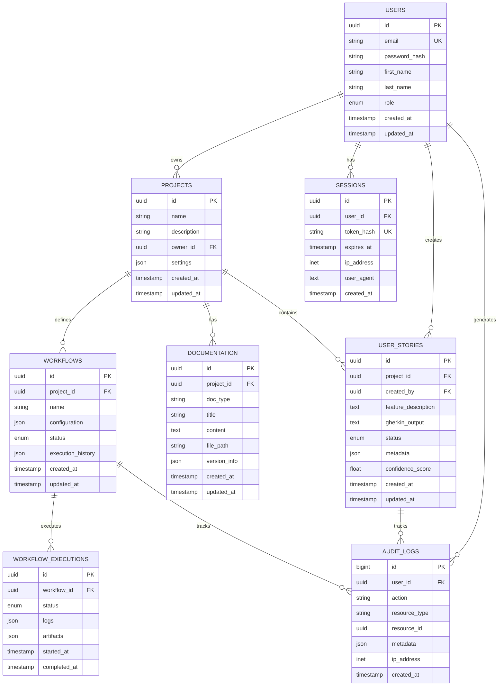

### 4.2 Data Partitioning Strategy

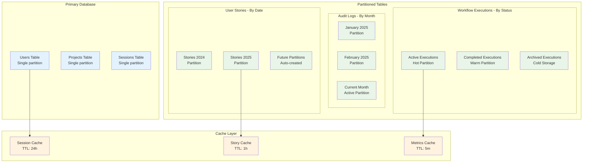

## 5. Deployment Architecture

### 5.1 Infrastructure Overview

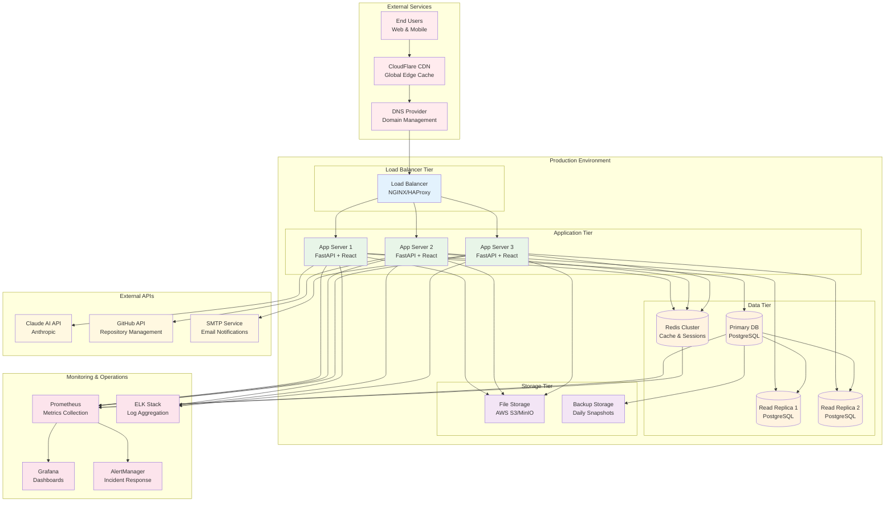

### 5.2 Container Architecture

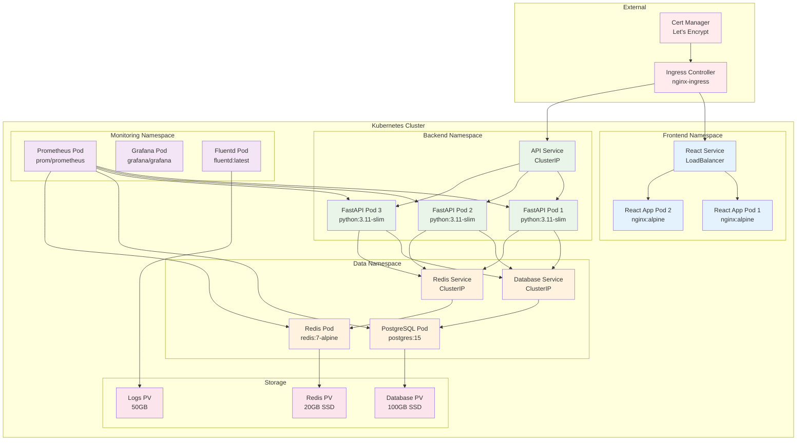

## 6. Security Architecture

### 6.1 Security Layers

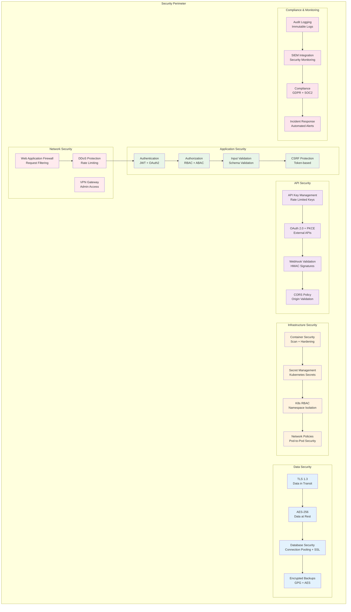

### 6.2 Authentication & Authorization Flow

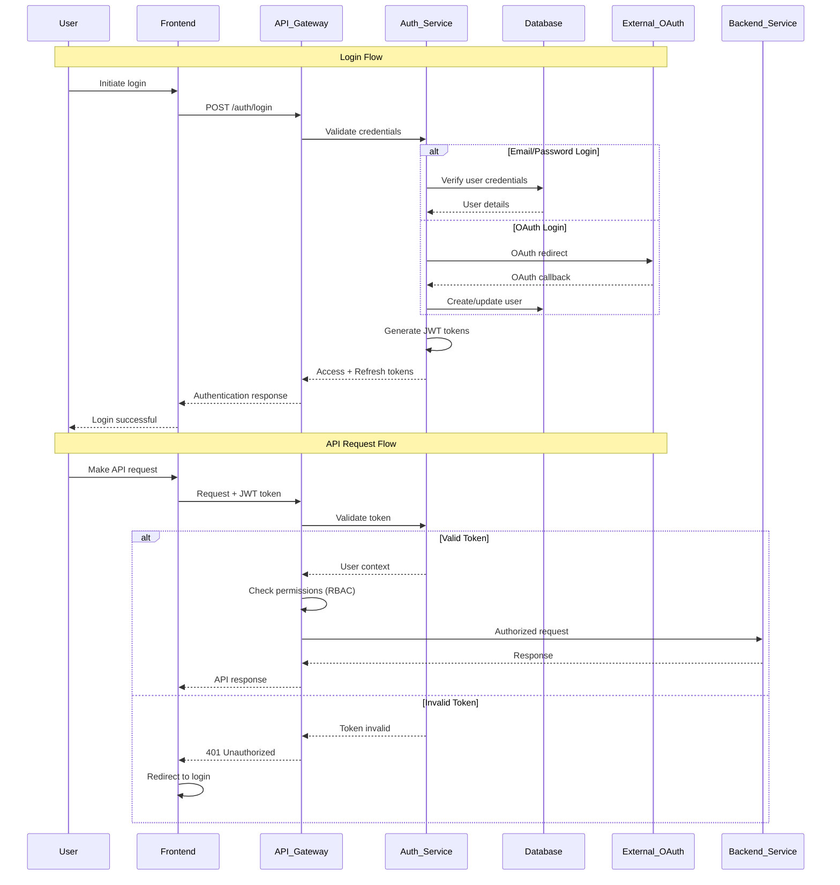

## 7. Performance Considerations

### 7.1 Performance Optimization Strategy

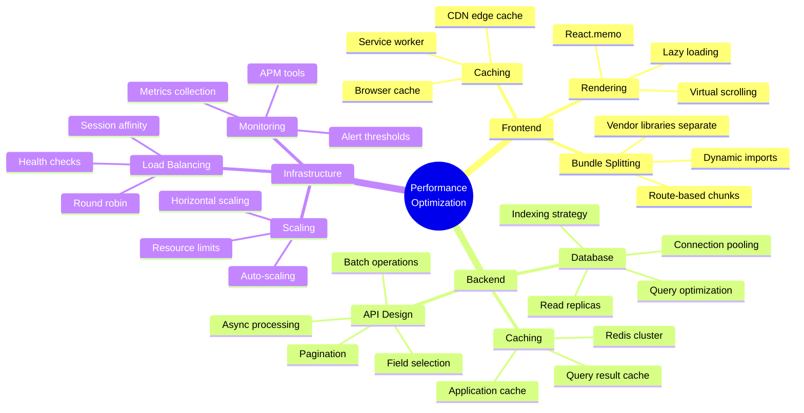

### 7.2 Caching Strategy

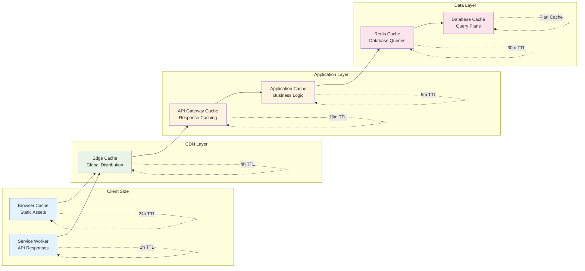

## 8. Integration Points

### 8.1 External Service Integration

```mermaid
graph TD
    subgraph "AutoDevHub Core"
        CORE[AutoDevHub<br/>Application Core]
    end
    
    subgraph "AI Services"
        CLAUDE[Claude AI<br/>Story Generation]
        OPENAI[OpenAI<br/>Code Analysis]
        HUGGING_FACE[Hugging Face<br/>Text Processing]
    end
    
    subgraph "Version Control"
        GITHUB[GitHub<br/>Repository Management]
        GITLAB[GitLab<br/>Alternative VCS]
        BITBUCKET[Bitbucket<br/>Atlassian Suite]
    end
    
    subgraph "CI/CD Platforms"
        GH_ACTIONS[GitHub Actions<br/>Workflow Automation]
        JENKINS[Jenkins<br/>Build Server]
        GITLAB_CI[GitLab CI<br/>Integrated Pipeline]
    end
    
    subgraph "Communication"
        SLACK[Slack<br/>Team Communication]
        TEAMS[Microsoft Teams<br/>Collaboration]
        DISCORD[Discord<br/>Community Chat]
        EMAIL[SMTP<br/>Email Notifications]
    end
    
    subgraph "Project Management"
        JIRA[Jira<br/>Issue Tracking]
        LINEAR[Linear<br/>Modern PM]
        ASANA[Asana<br/>Task Management]
        TRELLO[Trello<br/>Kanban Boards]
    end
    
    subgraph "Cloud Storage"
        AWS_S3[AWS S3<br/>File Storage]
        GCS[Google Cloud<br/>Storage]
        AZURE_BLOB[Azure Blob<br/>Storage]
    end
    
    %% Integration connections
    CORE --> CLAUDE
    CORE --> OPENAI
    CORE --> HUGGING_FACE
    
    CORE --> GITHUB
    CORE --> GITLAB
    CORE --> BITBUCKET
    
    CORE --> GH_ACTIONS
    CORE --> JENKINS
    CORE --> GITLAB_CI
    
    CORE --> SLACK
    CORE --> TEAMS
    CORE --> DISCORD
    CORE --> EMAIL
    
    CORE --> JIRA
    CORE --> LINEAR
    CORE --> ASANA
    CORE --> TRELLO
    
    CORE --> AWS_S3
    CORE --> GCS
    CORE --> AZURE_BLOB
    
    classDef core fill:#e3f2fd
    classDef ai fill:#e8f5e8
    classDef vcs fill:#fff3e0
    classDef cicd fill:#f3e5f5
    classDef comm fill:#fce4ec
    classDef pm fill:#ffebee
    classDef storage fill:#fff8e1
    
    class CORE core
    class CLAUDE,OPENAI,HUGGING_FACE ai
    class GITHUB,GITLAB,BITBUCKET vcs
    class GH_ACTIONS,JENKINS,GITLAB_CI cicd
    class SLACK,TEAMS,DISCORD,EMAIL comm
    class JIRA,LINEAR,ASANA,TRELLO pm
    class AWS_S3,GCS,AZURE_BLOB storage
```

### 8.2 API Integration Architecture

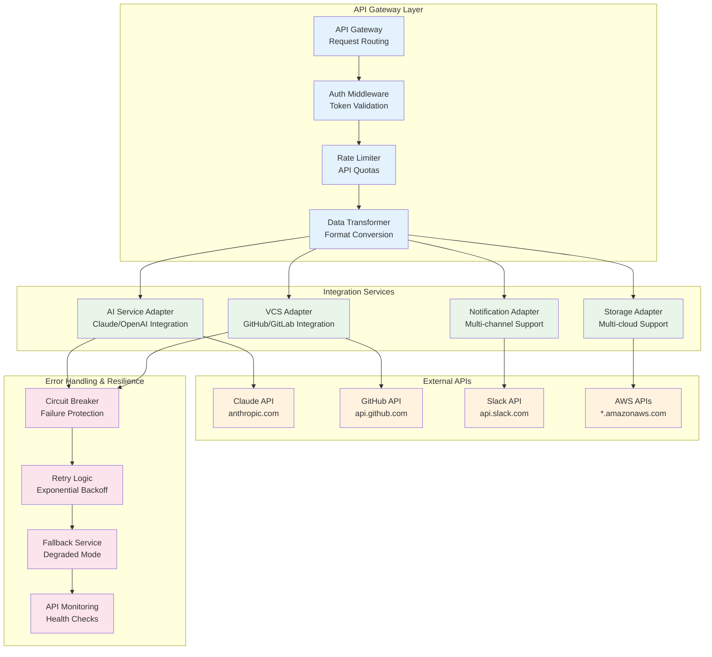

## 9. Scalability Architecture

### 9.1 Horizontal Scaling Strategy

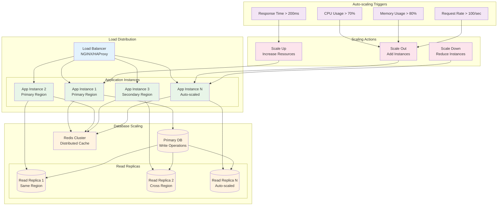

## 10. Monitoring and Observability

### 10.1 Observability Stack

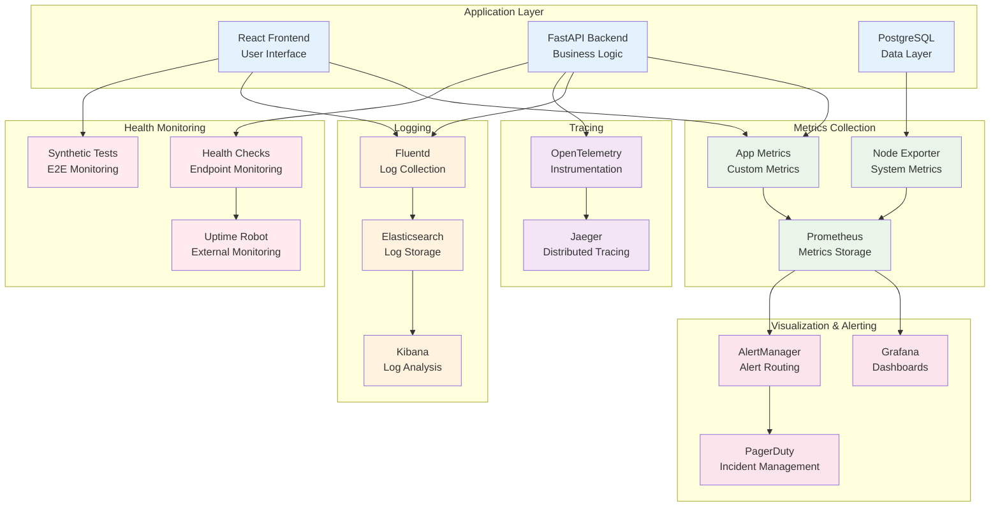

## Conclusion

This architecture documentation provides a comprehensive overview of the AutoDevHub system design, covering all aspects from high-level system architecture to detailed deployment strategies. The modular, scalable design ensures the system can grow with user needs while maintaining performance, security, and reliability.

The architecture emphasizes:
- **Scalability**: Horizontal scaling capabilities across all tiers
- **Resilience**: Fault tolerance and error recovery mechanisms
- **Security**: Multi-layered security approach with comprehensive monitoring
- **Performance**: Optimized caching and database strategies
- **Observability**: Complete monitoring and alerting infrastructure
- **Maintainability**: Clean separation of concerns and modular design

This documentation serves as the foundation for implementation and ongoing system evolution.