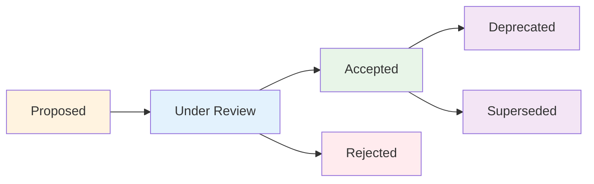

# Architecture Decision Records (ADRs)

This section contains all architectural decisions made during the development of AutoDevHub. Each ADR documents the context, decision, and consequences of important architectural choices.

## 📋 ADR Index

### Core Technology Decisions

#### [ADR-001: Backend Framework Selection]({{ '/docs/adr/ADR-001-backend-framework-selection.html' | relative_url }})
**Status**: ✅ Accepted  
**Decision**: FastAPI with Python 3.11  
**Key Factors**: Performance, type safety, automatic API documentation, async support

#### [ADR-002: Frontend Framework Selection]({{ '/docs/adr/ADR-002-frontend-framework-selection.html' | relative_url }})
**Status**: ✅ Accepted  
**Decision**: React 18 with TypeScript and Vite  
**Key Factors**: Component ecosystem, TypeScript support, development experience, performance

#### [ADR-003: Database Selection]({{ '/docs/adr/ADR-003-database-selection.html' | relative_url }})
**Status**: ✅ Accepted  
**Decision**: SQLite (development) / PostgreSQL (production)  
**Key Factors**: Development simplicity, production scalability, ACID compliance

### Integration & Platform Decisions

#### [ADR-004: AI Integration Platform]({{ '/docs/adr/ADR-004-ai-integration-platform.html' | relative_url }})
**Status**: ✅ Accepted  
**Decision**: Claude AI (Anthropic)  
**Key Factors**: Advanced reasoning, safety features, API reliability, cost effectiveness

#### [ADR-005: CI/CD Platform Selection]({{ '/docs/adr/ADR-005-cicd-platform-selection.html' | relative_url }})
**Status**: ✅ Accepted  
**Decision**: GitHub Actions  
**Key Factors**: Native GitHub integration, cost effectiveness, flexibility, extensive marketplace

#### [ADR-006: Documentation Hosting]({{ '/docs/adr/ADR-006-documentation-hosting.html' | relative_url }})
**Status**: ✅ Accepted  
**Decision**: GitHub Pages with Jekyll  
**Key Factors**: Zero cost, automatic deployment, Markdown support, version control integration

#### [ADR-007: Development Environment]({{ '/docs/adr/ADR-007-development-environment.html' | relative_url }})
**Status**: ✅ Accepted  
**Decision**: Docker with Dev Containers  
**Key Factors**: Environment consistency, onboarding simplicity, reproducibility

## 📊 ADR Summary Matrix

| ADR | Decision | Status | Impact | Dependencies |
|-----|----------|--------|---------|--------------|
| ADR-001 | FastAPI Backend | ✅ Accepted | High | Python ecosystem |
| ADR-002 | React Frontend | ✅ Accepted | High | Node.js ecosystem |
| ADR-003 | SQLite/PostgreSQL | ✅ Accepted | Medium | Database drivers |
| ADR-004 | Claude AI | ✅ Accepted | High | Anthropic API |
| ADR-005 | GitHub Actions | ✅ Accepted | Medium | GitHub platform |
| ADR-006 | GitHub Pages | ✅ Accepted | Low | Jekyll, GitHub |
| ADR-007 | Docker Dev Env | ✅ Accepted | Medium | Docker platform |

## 🎯 Decision Patterns

### Technology Selection Criteria

Our ADRs follow consistent evaluation criteria:

1. **Technical Fit**
   - Performance characteristics
   - Scalability requirements
   - Security considerations
   - Integration capabilities

2. **Team & Project Fit**
   - Learning curve and expertise
   - Development velocity impact
   - Long-term maintainability
   - Community and ecosystem

3. **Business Considerations**
   - Cost implications
   - Vendor lock-in risks
   - Compliance requirements
   - Market positioning

### Decision Quality Metrics

- **Completeness**: All ADRs include context, alternatives, and consequences
- **Traceability**: Clear links between decisions and requirements
- **Reversibility**: Documented exit strategies for major decisions
- **Impact Assessment**: Quantified benefits and risks where possible

## 🔄 ADR Lifecycle

### Status Progression

### Review Process
1. **Proposal**: Initial ADR draft with problem statement
2. **Review**: Technical review and stakeholder feedback
3. **Decision**: Final decision with rationale
4. **Implementation**: Execution of the decision
5. **Monitoring**: Ongoing assessment of decision outcomes

## 📈 Impact Analysis

### High-Impact Decisions
- **ADR-001 (FastAPI)**: Enables rapid API development with automatic documentation
- **ADR-002 (React)**: Provides modern, maintainable frontend architecture
- **ADR-004 (Claude AI)**: Core differentiator for intelligent story generation

### Medium-Impact Decisions
- **ADR-003 (Database)**: Balances development simplicity with production needs
- **ADR-005 (GitHub Actions)**: Streamlines CI/CD with zero additional cost
- **ADR-007 (Docker)**: Standardizes development environment

### Low-Impact Decisions
- **ADR-006 (GitHub Pages)**: Provides documentation hosting with minimal setup

## 🔗 Related Documentation

- **[System Architecture]({{ '/docs/architecture/' | relative_url }})**: Implementation of ADR decisions
- **[Development Guide]({{ '/docs/development/' | relative_url }})**: Practical application of technical decisions
- **[API Documentation]({{ '/docs/architecture/api-specification.html' | relative_url }})**: FastAPI implementation details

## 📝 Creating New ADRs

When proposing new architectural decisions:

1. **Use the ADR Template**: Follow the established format
2. **Research Alternatives**: Document at least 2-3 alternatives
3. **Quantify Impact**: Include performance, cost, and complexity analysis
4. **Seek Review**: Get input from relevant stakeholders
5. **Update Documentation**: Ensure decisions are reflected in implementation docs

---

*ADRs are living documents that evolve with our architectural understanding. Regular reviews ensure decisions remain relevant and effective.*