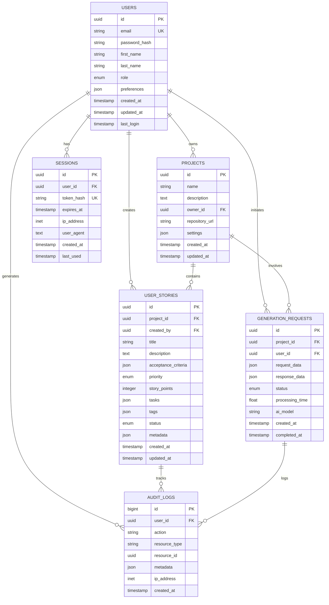

# Database Schema
{: .fs-9 }

Data models, relationships, and schema design
{: .fs-6 .fw-300 }

---

## Schema Overview

AutoDevHub uses SQLite as the primary database, providing zero-configuration setup while maintaining production-ready performance and reliability.

## Entity Relationship Diagram



---

## Table Definitions

### Users Table

```sql
CREATE TABLE users (
    id TEXT PRIMARY KEY DEFAULT (lower(hex(randomblob(16)))),
    email TEXT UNIQUE NOT NULL,
    password_hash TEXT NOT NULL,
    first_name TEXT,
    last_name TEXT,
    role TEXT DEFAULT 'USER' CHECK (role IN ('USER', 'ADMIN')),
    preferences JSON DEFAULT '{}',
    created_at TIMESTAMP DEFAULT CURRENT_TIMESTAMP,
    updated_at TIMESTAMP DEFAULT CURRENT_TIMESTAMP,
    last_login TIMESTAMP
);

-- Indexes
CREATE INDEX idx_users_email ON users(email);
CREATE INDEX idx_users_role ON users(role);
CREATE INDEX idx_users_created_at ON users(created_at);
```

**Fields Description**:
- `id`: UUID primary key
- `email`: Unique user email for authentication
- `password_hash`: Bcrypt hashed password
- `role`: User role (USER, ADMIN)
- `preferences`: JSON object for user settings

### Projects Table

```sql
CREATE TABLE projects (
    id TEXT PRIMARY KEY DEFAULT (lower(hex(randomblob(16)))),
    name TEXT NOT NULL,
    description TEXT,
    owner_id TEXT NOT NULL,
    repository_url TEXT,
    settings JSON DEFAULT '{}',
    created_at TIMESTAMP DEFAULT CURRENT_TIMESTAMP,
    updated_at TIMESTAMP DEFAULT CURRENT_TIMESTAMP,
    FOREIGN KEY (owner_id) REFERENCES users(id) ON DELETE CASCADE
);

-- Indexes
CREATE INDEX idx_projects_owner_id ON projects(owner_id);
CREATE INDEX idx_projects_name ON projects(name);
CREATE INDEX idx_projects_created_at ON projects(created_at);
```

**Settings JSON Schema**:
```json
{
  "ai_model": "claude-3",
  "story_template": "agile",
  "default_priority": "MEDIUM",
  "auto_assign_points": true,
  "include_tasks": true
}
```

### User Stories Table

```sql
CREATE TABLE user_stories (
    id TEXT PRIMARY KEY DEFAULT (lower(hex(randomblob(16)))),
    project_id TEXT NOT NULL,
    created_by TEXT NOT NULL,
    title TEXT NOT NULL,
    description TEXT NOT NULL,
    acceptance_criteria JSON DEFAULT '[]',
    priority TEXT DEFAULT 'MEDIUM' CHECK (priority IN ('LOW', 'MEDIUM', 'HIGH', 'CRITICAL')),
    story_points INTEGER DEFAULT 0,
    tasks JSON DEFAULT '[]',
    tags JSON DEFAULT '[]',
    status TEXT DEFAULT 'DRAFT' CHECK (status IN ('DRAFT', 'READY', 'IN_PROGRESS', 'DONE')),
    metadata JSON DEFAULT '{}',
    created_at TIMESTAMP DEFAULT CURRENT_TIMESTAMP,
    updated_at TIMESTAMP DEFAULT CURRENT_TIMESTAMP,
    FOREIGN KEY (project_id) REFERENCES projects(id) ON DELETE CASCADE,
    FOREIGN KEY (created_by) REFERENCES users(id) ON DELETE SET NULL
);

-- Indexes
CREATE INDEX idx_stories_project_id ON user_stories(project_id);
CREATE INDEX idx_stories_created_by ON user_stories(created_by);
CREATE INDEX idx_stories_priority ON user_stories(priority);
CREATE INDEX idx_stories_status ON user_stories(status);
CREATE INDEX idx_stories_created_at ON user_stories(created_at);

-- Full-text search
CREATE VIRTUAL TABLE stories_fts USING fts5(
    title, description, content=user_stories, content_rowid=rowid
);
```

**JSON Field Schemas**:

**Acceptance Criteria**:
```json
[
  "Given I am on the login page",
  "When I enter valid credentials",
  "Then I should be redirected to the dashboard"
]
```

**Tasks**:
```json
[
  "Create login form component",
  "Implement authentication API",
  "Add error handling",
  "Write unit tests"
]
```

**Tags**:
```json
["authentication", "user-management", "security"]
```

**Metadata**:
```json
{
  "generation_request_id": "req_123456789",
  "ai_confidence": 0.95,
  "estimated_hours": 8,
  "complexity": "medium",
  "dependencies": ["story_456"]
}
```

### Generation Requests Table

```sql
CREATE TABLE generation_requests (
    id TEXT PRIMARY KEY DEFAULT (lower(hex(randomblob(16)))),
    project_id TEXT,
    user_id TEXT NOT NULL,
    request_data JSON NOT NULL,
    response_data JSON,
    status TEXT DEFAULT 'PENDING' CHECK (status IN ('PENDING', 'PROCESSING', 'COMPLETED', 'FAILED')),
    processing_time REAL,
    ai_model TEXT,
    error_message TEXT,
    created_at TIMESTAMP DEFAULT CURRENT_TIMESTAMP,
    completed_at TIMESTAMP,
    FOREIGN KEY (project_id) REFERENCES projects(id) ON DELETE SET NULL,
    FOREIGN KEY (user_id) REFERENCES users(id) ON DELETE CASCADE
);

-- Indexes
CREATE INDEX idx_requests_user_id ON generation_requests(user_id);
CREATE INDEX idx_requests_project_id ON generation_requests(project_id);
CREATE INDEX idx_requests_status ON generation_requests(status);
CREATE INDEX idx_requests_created_at ON generation_requests(created_at);
```

### Sessions Table

```sql
CREATE TABLE sessions (
    id TEXT PRIMARY KEY DEFAULT (lower(hex(randomblob(16)))),
    user_id TEXT NOT NULL,
    token_hash TEXT UNIQUE NOT NULL,
    expires_at TIMESTAMP NOT NULL,
    ip_address TEXT,
    user_agent TEXT,
    created_at TIMESTAMP DEFAULT CURRENT_TIMESTAMP,
    last_used TIMESTAMP DEFAULT CURRENT_TIMESTAMP,
    FOREIGN KEY (user_id) REFERENCES users(id) ON DELETE CASCADE
);

-- Indexes
CREATE INDEX idx_sessions_user_id ON sessions(user_id);
CREATE INDEX idx_sessions_token_hash ON sessions(token_hash);
CREATE INDEX idx_sessions_expires_at ON sessions(expires_at);

-- Cleanup expired sessions
CREATE TRIGGER cleanup_expired_sessions
    AFTER INSERT ON sessions
BEGIN
    DELETE FROM sessions WHERE expires_at < datetime('now');
END;
```

### Audit Logs Table

```sql
CREATE TABLE audit_logs (
    id INTEGER PRIMARY KEY AUTOINCREMENT,
    user_id TEXT,
    action TEXT NOT NULL,
    resource_type TEXT NOT NULL,
    resource_id TEXT,
    metadata JSON DEFAULT '{}',
    ip_address TEXT,
    created_at TIMESTAMP DEFAULT CURRENT_TIMESTAMP,
    FOREIGN KEY (user_id) REFERENCES users(id) ON DELETE SET NULL
);

-- Indexes
CREATE INDEX idx_audit_logs_user_id ON audit_logs(user_id);
CREATE INDEX idx_audit_logs_action ON audit_logs(action);
CREATE INDEX idx_audit_logs_resource_type ON audit_logs(resource_type);
CREATE INDEX idx_audit_logs_created_at ON audit_logs(created_at);
```

---

## Data Access Patterns

### Common Queries

#### Get User Stories for Project
```sql
SELECT 
    s.*,
    u.first_name || ' ' || u.last_name as creator_name
FROM user_stories s
JOIN users u ON s.created_by = u.id
WHERE s.project_id = ?
ORDER BY 
    CASE s.priority 
        WHEN 'CRITICAL' THEN 1
        WHEN 'HIGH' THEN 2
        WHEN 'MEDIUM' THEN 3
        WHEN 'LOW' THEN 4
    END,
    s.created_at DESC;
```

#### Search Stories by Text
```sql
SELECT 
    s.*,
    fts.rank
FROM stories_fts fts
JOIN user_stories s ON fts.rowid = s.rowid
WHERE stories_fts MATCH ?
ORDER BY fts.rank;
```

#### Get User Activity
```sql
SELECT 
    COUNT(CASE WHEN s.created_at > datetime('now', '-7 days') THEN 1 END) as stories_this_week,
    COUNT(CASE WHEN r.created_at > datetime('now', '-7 days') THEN 1 END) as requests_this_week,
    MAX(s.created_at) as last_story_created
FROM users u
LEFT JOIN user_stories s ON u.id = s.created_by
LEFT JOIN generation_requests r ON u.id = r.user_id
WHERE u.id = ?;
```

### Performance Optimizations

#### Query Optimization
```sql
-- Composite index for common filtering
CREATE INDEX idx_stories_project_status_priority 
ON user_stories(project_id, status, priority);

-- Covering index for story lists
CREATE INDEX idx_stories_list 
ON user_stories(project_id, created_at) 
INCLUDE (title, priority, status, story_points);
```

#### Connection Pooling Configuration
```python
# SQLAlchemy configuration
engine = create_engine(
    database_url,
    pool_size=20,
    max_overflow=30,
    pool_pre_ping=True,
    pool_recycle=3600
)
```

---

## Data Migration

### Migration System

#### Alembic Configuration
```python
# alembic/env.py
from sqlalchemy import create_engine
from app.models import Base

target_metadata = Base.metadata

def run_migrations_online():
    connectable = create_engine(config.get_main_option("sqlalchemy.url"))
    
    with connectable.connect() as connection:
        context.configure(
            connection=connection,
            target_metadata=target_metadata
        )
        
        with context.begin_transaction():
            context.run_migrations()
```

#### Sample Migration
```python
# migrations/versions/001_initial_schema.py
from alembic import op
import sqlalchemy as sa

def upgrade():
    # Create users table
    op.create_table(
        'users',
        sa.Column('id', sa.String(), primary_key=True),
        sa.Column('email', sa.String(), unique=True, nullable=False),
        sa.Column('password_hash', sa.String(), nullable=False),
        sa.Column('created_at', sa.DateTime(), default=sa.func.now())
    )

def downgrade():
    op.drop_table('users')
```

---

## Data Validation

### Model Validation
```python
from pydantic import BaseModel, validator
from typing import List, Optional
from enum import Enum

class Priority(str, Enum):
    LOW = "LOW"
    MEDIUM = "MEDIUM"
    HIGH = "HIGH"
    CRITICAL = "CRITICAL"

class StoryCreate(BaseModel):
    title: str
    description: str
    acceptance_criteria: List[str] = []
    priority: Priority = Priority.MEDIUM
    story_points: int = 0
    tags: List[str] = []
    
    @validator('title')
    def title_must_not_be_empty(cls, v):
        if not v.strip():
            raise ValueError('Title cannot be empty')
        return v.strip()
    
    @validator('story_points')
    def valid_story_points(cls, v):
        if v < 0 or v > 21:
            raise ValueError('Story points must be between 0 and 21')
        return v
```

---

## Backup and Recovery

### Backup Strategy
```bash
#!/bin/bash
# backup_database.sh

DB_PATH="/app/data/autodevhub.db"
BACKUP_DIR="/app/backups"
DATE=$(date +%Y%m%d_%H%M%S)

# Create backup
sqlite3 $DB_PATH ".backup $BACKUP_DIR/autodevhub_$DATE.db"

# Compress backup
gzip "$BACKUP_DIR/autodevhub_$DATE.db"

# Verify backup
if [ -f "$BACKUP_DIR/autodevhub_$DATE.db.gz" ]; then
    echo "Backup created successfully: autodevhub_$DATE.db.gz"
else
    echo "Backup failed"
    exit 1
fi

# Clean old backups (keep 30 days)
find $BACKUP_DIR -name "*.gz" -mtime +30 -delete
```

### Recovery Process
```bash
#!/bin/bash
# restore_database.sh

BACKUP_FILE=$1
DB_PATH="/app/data/autodevhub.db"

if [ -z "$BACKUP_FILE" ]; then
    echo "Usage: $0 <backup_file.gz>"
    exit 1
fi

# Stop application
sudo systemctl stop autodevhub

# Backup current database
mv $DB_PATH "${DB_PATH}.old"

# Restore from backup
gunzip -c $BACKUP_FILE > $DB_PATH

# Verify restoration
sqlite3 $DB_PATH "PRAGMA integrity_check;"

# Restart application
sudo systemctl start autodevhub

echo "Database restored from $BACKUP_FILE"
```

---

## Monitoring and Maintenance

### Database Health Checks
```sql
-- Check database integrity
PRAGMA integrity_check;

-- Check foreign key constraints
PRAGMA foreign_key_check;

-- Analyze database statistics
ANALYZE;

-- Check table sizes
SELECT 
    name as table_name,
    (SELECT COUNT(*) FROM sqlite_master WHERE type='index' AND tbl_name=m.name) as index_count,
    (SELECT COUNT(*) FROM m.name) as row_count
FROM sqlite_master m 
WHERE type='table' AND name NOT LIKE 'sqlite_%';
```

### Performance Monitoring
```python
# Database performance monitoring
import time
from functools import wraps

def monitor_query(func):
    @wraps(func)
    def wrapper(*args, **kwargs):
        start_time = time.time()
        result = func(*args, **kwargs)
        execution_time = time.time() - start_time
        
        if execution_time > 1.0:  # Log slow queries
            logger.warning(f"Slow query detected: {func.__name__} took {execution_time:.2f}s")
            
        return result
    return wrapper
```

---

*For API integration details, see [API Specification](). For system overview, see [System Overview]().*