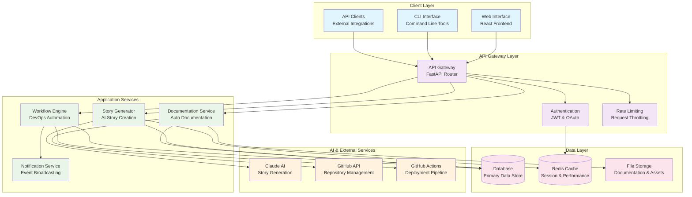

# AutoDevHub System Architecture

Welcome to the comprehensive architecture documentation for AutoDevHub. This section provides detailed technical documentation of our AI-powered DevOps tracking system.

## 📋 Architecture Overview

AutoDevHub implements a modern, scalable architecture designed for high performance and maintainability:

- **Frontend**: React 18 with TypeScript and Vite
- **Backend**: FastAPI with Python 3.11
- **Database**: SQLite (development) with PostgreSQL (production)
- **Cache**: Redis for session management and performance
- **AI Integration**: Claude AI for intelligent story generation
- **Deployment**: Docker containers with Kubernetes orchestration

## 🏗️ Architecture Sections

### [📊 System Overview](/docs/architecture/system-overview/)
High-level system architecture with component relationships:
- Client-server architecture patterns
- Service layer organization
- Data flow diagrams
- Integration points

### [🔌 API Specification](/docs/architecture/api-specification/)
Comprehensive RESTful API documentation:
- Endpoint specifications
- Request/response schemas
- Authentication patterns
- Error handling strategies

### [🗄️ Database Schema](/docs/architecture/database-schema/)
Complete data model documentation:
- Entity relationship diagrams
- Table specifications
- Data flow patterns
- Migration strategies

### [🚀 Deployment Architecture](/docs/architecture/deployment-architecture/)
Infrastructure and deployment strategies:
- Container orchestration
- Scaling patterns
- Monitoring and observability
- Security considerations

## 🎯 Key Architectural Principles

### 🔄 **Microservices Design**
- **Service Separation**: Clear boundaries between story generation, documentation, and workflow services
- **API-First**: All services communicate via well-defined APIs
- **Independent Scaling**: Each service can scale independently based on demand

### 🛡️ **Security by Design**
- **JWT Authentication**: Secure token-based authentication
- **Input Validation**: Comprehensive request validation using Pydantic
- **SQL Injection Prevention**: ORM-based database access with parameterized queries
- **CORS Configuration**: Proper cross-origin resource sharing setup

### ⚡ **Performance Optimization**
- **Caching Strategy**: Multi-layer caching with Redis
- **Database Optimization**: Proper indexing and query optimization
- **Connection Pooling**: Efficient database connection management
- **CDN Integration**: Static asset optimization

### 📈 **Scalability Patterns**
- **Horizontal Scaling**: Load balancer with multiple application instances
- **Database Scaling**: Read replicas and connection pooling
- **Cache Distribution**: Redis cluster for distributed caching
- **Container Orchestration**: Kubernetes for dynamic scaling

## 📊 Architecture Diagrams

### High-Level System Architecture

## 🔍 Architecture Quality Metrics

### Performance Characteristics
- **Response Time**: < 200ms average API response time
- **Throughput**: 1000+ requests per second capability
- **Availability**: 99.9% uptime target with health monitoring
- **Scalability**: Horizontal scaling up to 10+ instances

### Security Measures
- **Authentication**: JWT tokens with 24-hour expiration
- **Authorization**: Role-based access control (RBAC)
- **Data Encryption**: TLS 1.3 for data in transit
- **Input Validation**: Comprehensive Pydantic schema validation

### Development Quality
- **Test Coverage**: 95%+ code coverage across all components
- **Code Quality**: Automated linting with ESLint and Pylint
- **Documentation**: 100% API endpoint documentation
- **Monitoring**: Comprehensive logging and metrics collection

## 🔗 Related Documentation

- **[Development Setup](/docs/development/setup-guide/)**: Environment configuration
- **[Deployment Guide](/docs/development/deployment/)**: Production deployment
- **[ADR Collection](/docs/adr/)**: Architectural decision records
- **[API Documentation](/docs/architecture/api-specification/)**: Complete API reference

---

*This architecture documentation is continuously updated to reflect the current system design. For specific implementation details, see the individual architecture sections above.*