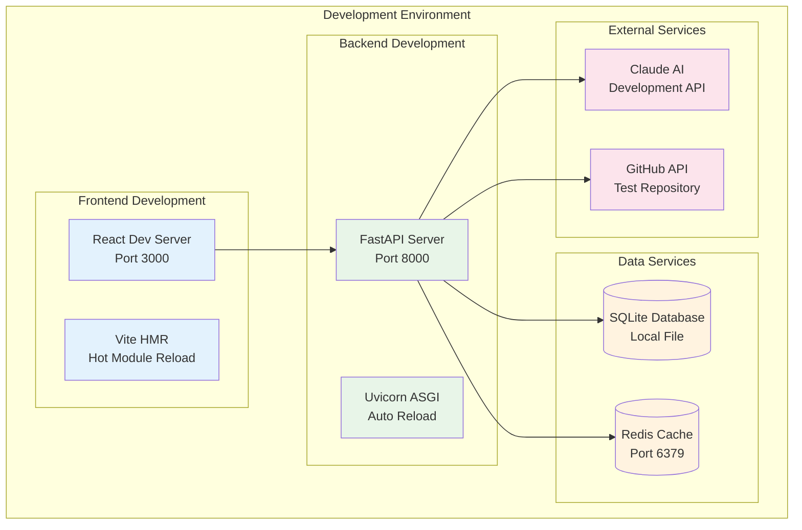

# AutoDevHub Development Guide

Complete development resources for contributing to AutoDevHub, from initial setup to production deployment.

## 🚀 Quick Start

### Prerequisites
- **Node.js** 18+ and npm/yarn
- **Python** 3.11+ with pip
- **Docker** and Docker Compose
- **Git** for version control

### One-Command Setup
```bash
git clone https://github.com/ai-cohort-july-2025/AI-Cohort-July-2025.git
cd AI-Cohort-July-2025
./dev-setup.sh && docker-compose up -d
```

Access your development environment at `http://localhost:3000`

## 📚 Development Documentation

### [⚙️ Setup Guide](/docs/development/setup-guide/)
Complete environment configuration:
- **Prerequisites**: Required software and versions
- **Environment Setup**: Step-by-step configuration
- **Dependencies**: Backend and frontend package installation
- **Database Initialization**: Local database setup
- **Configuration**: Environment variables and API keys

### [🚀 Deployment](/docs/development/deployment/)
Production deployment procedures:
- **Docker Deployment**: Container-based deployment
- **Kubernetes**: Orchestrated deployment strategies
- **Environment Configuration**: Production settings
- **Monitoring Setup**: Health checks and logging
- **CI/CD Pipeline**: Automated deployment workflows

### [🤝 Contributing](/docs/development/contributing/)
Contribution guidelines and standards:
- **Code Standards**: Style guides and conventions
- **Pull Request Process**: Review workflow and requirements
- **Testing Requirements**: Unit and integration testing
- **Documentation Standards**: Writing and maintaining docs

## 🛠️ Development Environment

### Architecture Overview


### Development Workflow

#### 1. **Environment Setup**
```bash
# Clone repository
git clone https://github.com/ai-cohort-july-2025/AI-Cohort-July-2025.git
cd AI-Cohort-July-2025

# Setup development environment
chmod +x dev-setup.sh
./dev-setup.sh
```

#### 2. **Backend Development**
```bash
# Navigate to backend
cd backend

# Create virtual environment
python -m venv venv
source venv/bin/activate  # On Windows: venv\Scripts\activate

# Install dependencies
pip install -r requirements.txt

# Initialize database
python init_db.py

# Start development server
uvicorn main:app --reload --host 0.0.0.0 --port 8000
```

#### 3. **Frontend Development**
```bash
# Navigate to frontend
cd frontend

# Install dependencies
npm install

# Start development server
npm run dev
```

#### 4. **Docker Development**
```bash
# Start all services
docker-compose up -d

# View logs
docker-compose logs -f

# Stop services
docker-compose down
```

## 🧪 Testing Strategy

### Backend Testing (pytest)
```bash
# Run all tests
pytest

# Run with coverage
pytest --cov=. --cov-report=html

# Run specific test file
pytest tests/test_story_generator.py

# Run with verbose output
pytest -v -s
```

### Frontend Testing (Jest)
```bash
# Run all tests
npm test

# Run with coverage
npm run test:coverage

# Run in watch mode
npm run test:watch

# Run specific test
npm test StoryGenerator.test.jsx
```

### Integration Testing
```bash
# End-to-end tests
npm run test:e2e

# API integration tests
pytest tests/integration/

# Full test suite
npm run test:all
```

## 📊 Code Quality

### Automated Quality Checks
- **ESLint**: Frontend code linting
- **Pylint**: Backend code analysis
- **Prettier**: Code formatting
- **Bandit**: Security vulnerability scanning
- **Jest/pytest**: Automated testing

### Quality Metrics
- **Test Coverage**: 95%+ requirement
- **Code Quality**: A-grade automated assessment
- **Security**: Zero high-severity vulnerabilities
- **Performance**: < 200ms API response time

### Pre-commit Hooks
```bash
# Install pre-commit hooks
pre-commit install

# Run hooks manually
pre-commit run --all-files
```

## 🔧 Development Tools

### Recommended IDE Extensions
- **VS Code**: Primary recommended IDE
- **Python**: Official Python extension
- **ES7+ React/Redux/React-Native snippets**: React development
- **Prettier**: Code formatting
- **ESLint**: JavaScript linting
- **GitLens**: Git integration

### Debugging Setup
- **Backend**: VS Code Python debugger configuration
- **Frontend**: React Developer Tools
- **Database**: SQLite browser for local development
- **API**: Postman/Insomnia for API testing

## 🚀 Performance Optimization

### Development Performance
- **Hot Module Reload**: Instant frontend updates
- **Auto-reload**: Automatic backend restart on changes
- **Incremental Builds**: Fast compilation with Vite
- **Caching**: Redis for development data caching

### Production Optimization
- **Bundle Optimization**: Webpack/Vite production builds
- **Image Optimization**: Compressed assets
- **Database Optimization**: Query analysis and indexing
- **CDN Integration**: Static asset optimization

## 📈 Monitoring & Observability

### Development Monitoring
- **Console Logging**: Structured logging for development
- **Error Tracking**: Development error reporting
- **Performance Metrics**: Local performance monitoring
- **Health Checks**: Service availability monitoring

### Production Monitoring
- **Application Monitoring**: Performance and error tracking
- **Infrastructure Monitoring**: System metrics and alerts
- **Log Aggregation**: Centralized logging with ELK stack
- **User Analytics**: Usage tracking and behavior analysis

## 🔗 Development Resources

### Documentation Links
- **[System Architecture](/docs/architecture/)**: Technical architecture overview
- **[API Documentation](/docs/architecture/api-specification/)**: RESTful API reference
- **[Database Schema](/docs/architecture/database-schema/)**: Data model documentation
- **[ADR Collection](/docs/adr/)**: Architectural decision records

### External Resources
- **[FastAPI Documentation](https://fastapi.tiangolo.com/)**: Backend framework docs
- **[React Documentation](https://react.dev/)**: Frontend framework docs
- **[Claude AI API](https://docs.anthropic.com/)**: AI integration documentation
- **[GitHub Actions](https://docs.github.com/en/actions)**: CI/CD platform docs

## 🤝 Community & Support

### Getting Help
- **GitHub Issues**: Bug reports and feature requests
- **GitHub Discussions**: Community Q&A and ideas
- **Code Reviews**: Collaborative improvement process
- **Documentation**: Comprehensive guides and references

### Contributing Guidelines
- **Code Style**: Follow established conventions
- **Testing**: Maintain high test coverage
- **Documentation**: Update docs for all changes
- **Review Process**: Participate in collaborative reviews

---

*This development guide is continuously updated to reflect best practices and new tools. Contribute improvements via pull requests.*