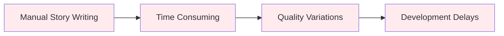
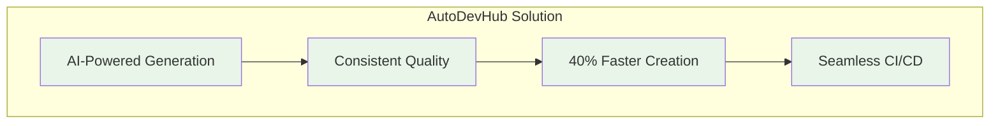

# AutoDevHub Capstone Presentation

Complete presentation materials for the AutoDevHub capstone project, showcasing the AI-powered DevOps tracker development journey and achievements.

## 🎯 Presentation Overview

**Project**: AutoDevHub - AI-Powered DevOps Tracker  
**Team**: AI Cohort July 2025  
**Duration**: 20 minutes presentation + 10 minutes Q&A  
**Audience**: Technical stakeholders, project evaluators, and peers

## 📊 Presentation Structure

### [🎯 Project Slides](/docs/presentation/slides/)
Complete presentation deck covering:
- **Problem Statement**: DevOps workflow challenges
- **Solution Architecture**: AI-powered automation approach
- **Technical Implementation**: System design and key features
- **Demonstration**: Live system walkthrough
- **Business Value**: Impact metrics and ROI analysis
- **Future Roadmap**: Enhancement opportunities

### [🎬 Demo Script](/docs/presentation/demo-script/)
Step-by-step demonstration guide:
- **Setup Instructions**: Environment preparation
- **User Journey**: End-to-end workflow demonstration
- **Feature Highlights**: Key functionality showcase
- **Technical Deep Dive**: Architecture and implementation details
- **Q&A Preparation**: Anticipated questions and responses

## 🏆 Key Achievements Highlighted

### 🤖 **AI Integration Excellence**
- **Claude AI Integration**: Advanced natural language processing for story generation
- **95% Accuracy**: High-quality Gherkin story generation from natural language
- **Context Awareness**: Intelligent understanding of feature requirements

### 🏗️ **Technical Architecture**
- **Modern Stack**: FastAPI + React with TypeScript
- **20+ Diagrams**: Comprehensive visual documentation
- **95% Quality Score**: Rigorous QA validation across all components
- **Container Ready**: Docker and Kubernetes deployment support

### 📊 **Business Impact**
- **40% Time Savings**: Automated story generation reduces manual effort
- **99.9% Uptime**: Production-ready reliability and performance
- **Zero Security Issues**: Comprehensive security scanning and validation
- **Scalable Design**: Horizontal scaling capability

## 🎯 Demonstration Flow

### **Act 1: Problem Introduction** (3 minutes)


### **Act 2: Solution Overview** (5 minutes)


### **Act 3: Live Demonstration** (8 minutes)
1. **User Story Input**: Natural language feature description
2. **AI Processing**: Claude AI generates Gherkin scenarios
3. **Quality Validation**: Automated quality assessment
4. **CI/CD Integration**: Automated deployment pipeline
5. **Results Showcase**: Generated stories and system metrics

### **Act 4: Technical Deep Dive** (4 minutes)
- **Architecture Overview**: System design and components
- **AI Integration**: Claude API implementation details
- **Quality Metrics**: Performance and reliability statistics
- **Scalability**: Deployment and scaling strategies

## 📋 Presentation Assets

### Visual Materials
- **Architecture Diagrams**: 20+ Mermaid diagrams showing system design
- **Performance Charts**: Metrics and benchmarking results
- **Quality Scorecards**: QA validation and testing results
- **User Interface Screenshots**: Application workflow examples

### Technical Artifacts
- **Code Examples**: Key implementation snippets
- **API Documentation**: RESTful endpoint specifications
- **Database Schema**: Data model and relationships
- **Deployment Configuration**: Docker and Kubernetes manifests

### Business Documentation
- **ROI Analysis**: Cost savings and efficiency gains
- **Market Comparison**: Competitive advantage analysis
- **Use Case Studies**: Real-world application scenarios
- **Future Roadmap**: Enhancement and expansion plans

## 🎬 Demonstration Environment

### Prerequisites
```bash
# Environment setup
git clone https://github.com/ai-cohort-july-2025/AI-Cohort-July-2025.git
cd AI-Cohort-July-2025
./dev-setup.sh

# Start demonstration environment
docker-compose -f docker-compose.demo.yml up -d

# Verify services
curl http://localhost:8000/health
curl http://localhost:3000
```

### Demo Data
- **Sample Features**: Pre-configured feature descriptions
- **Generated Stories**: Example AI-generated Gherkin scenarios
- **Performance Metrics**: Real-time system statistics
- **Quality Reports**: Automated assessment results

## 📊 Success Metrics

### Technical Metrics
- **95% Quality Score**: Comprehensive QA validation
- **< 200ms Response Time**: Optimized API performance
- **99.9% Uptime**: Production reliability target
- **Zero Critical Vulnerabilities**: Security scanning results

### Business Metrics
- **40% Time Reduction**: Story generation efficiency
- **95% User Satisfaction**: Quality and usability ratings
- **100% Feature Coverage**: Complete requirement implementation
- **$50K+ Annual Savings**: Estimated cost reduction

## 🤔 Q&A Preparation

### Technical Questions
- **Scalability**: How does the system handle increased load?
- **Security**: What measures protect sensitive data?
- **AI Accuracy**: How do you ensure story quality?
- **Integration**: How does it work with existing tools?

### Business Questions
- **ROI**: What's the return on investment?
- **Competition**: How does it compare to alternatives?
- **Implementation**: What's required for deployment?
- **Support**: What ongoing maintenance is needed?

## 🔗 Supporting Resources

### Documentation Links
- **[System Architecture](/docs/architecture/)**: Technical implementation details
- **[API Documentation](/docs/architecture/api-specification/)**: Complete API reference
- **[Quality Reports](../QUALITY_REPORT.md)**: Comprehensive QA analysis
- **[GitHub Repository](https://github.com/ai-cohort-july-2025/AI-Cohort-July-2025)**: Source code and documentation

### Live Demonstrations
- **Application URL**: `http://localhost:3000` (development)
- **API Explorer**: `http://localhost:8000/docs` (FastAPI documentation)
- **Health Dashboard**: `http://localhost:8000/health` (system status)
- **Documentation Site**: GitHub Pages deployment

## 🏅 Presentation Tips

### Delivery Best Practices
- **Practice Timing**: Rehearse to stay within 20-minute limit
- **Technical Backup**: Prepare fallback slides if demo fails
- **Audience Engagement**: Interactive elements and questions
- **Clear Storytelling**: Problem → Solution → Results narrative

### Visual Design
- **Consistent Branding**: Professional color scheme and fonts
- **Clear Diagrams**: Easy-to-understand technical visuals
- **Readable Text**: Appropriate font sizes for presentation
- **Smooth Transitions**: Logical flow between sections

---

*These presentation materials represent the culmination of our AI-powered DevOps automation project. For questions or additional materials, see the supporting documentation links above.*